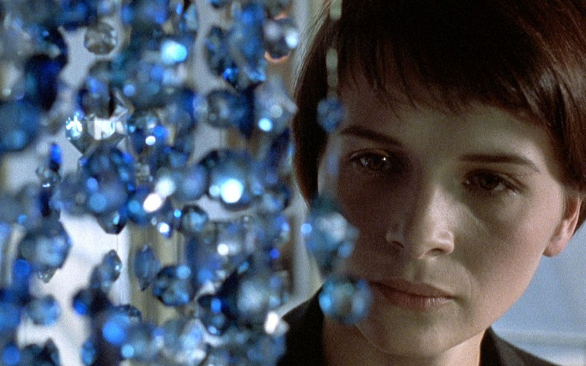

Kieslowski's *Blue* is about loss, but more than that, it's about what happens when you try to escape the weight of being alive. Julie loses her husband and daughter in a car accident. She wants nothing: no house, no friends, no music. She tries to live in silence, in emptiness, in what Milan Kundera would call the "lightness of being."

But here's the trick: lightness isn't light at all. The quieter Julie makes her world, the louder her past comes back. Music she thought she destroyed keeps haunting her. People she pushes away return. Even the color blue follows her like a stubborn ghost. It's like Kafka's joke: you can burn the score, but the melody still plays.

Kundera said life is unbearable either way: too heavy with meaning, or too light and meaningless. Julie floats in that blue swimming pool, but the water itself presses on her body. Lightness turns heavy.

And yet, she doesn't vanish. She chooses to step back into music, into love, into risk. Freedom, it turns out, isn't about escaping ties: it's about choosing which ones you keep.

#movie #cinema #blue

